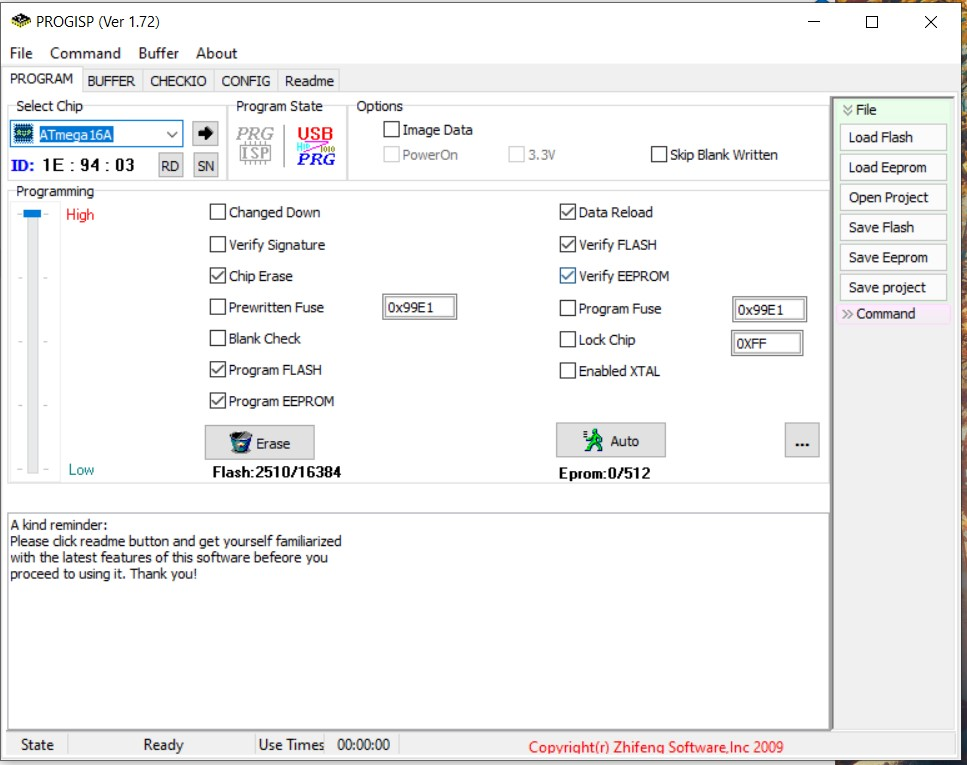
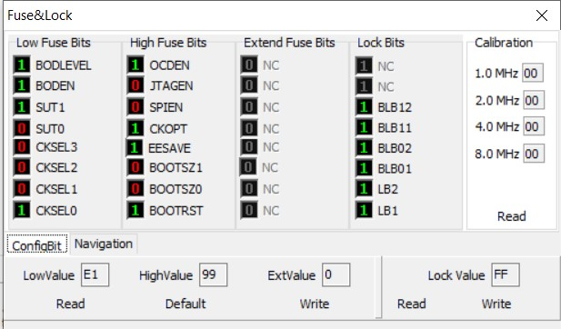
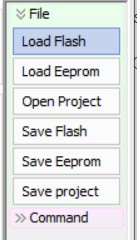
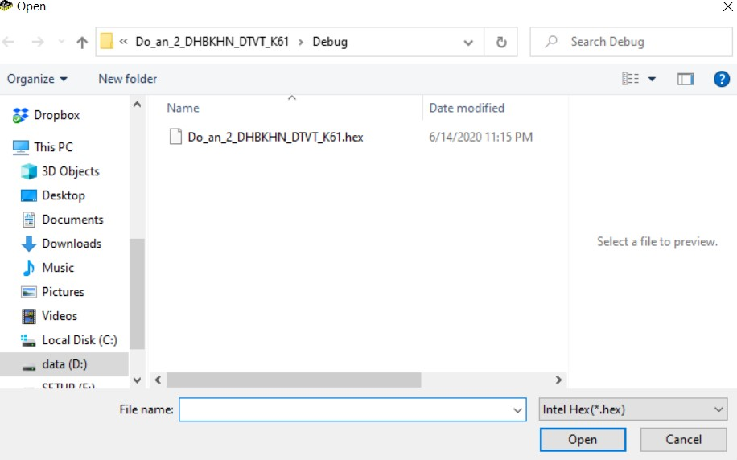
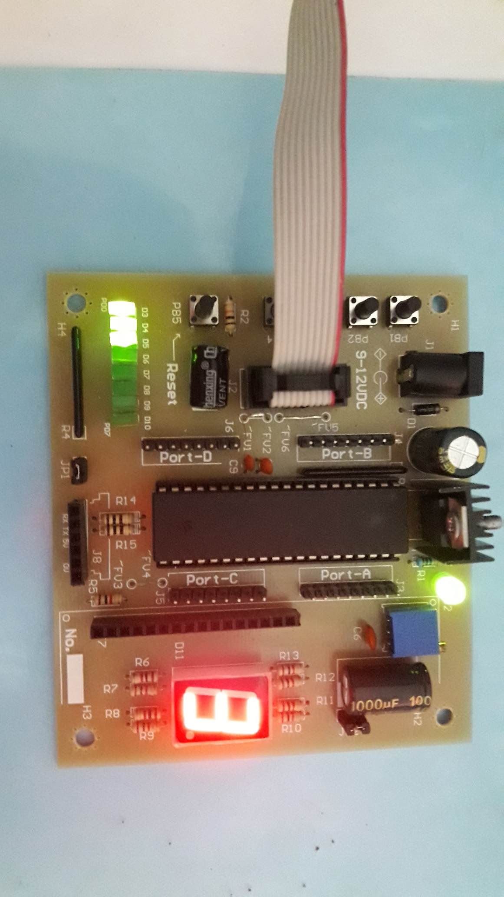
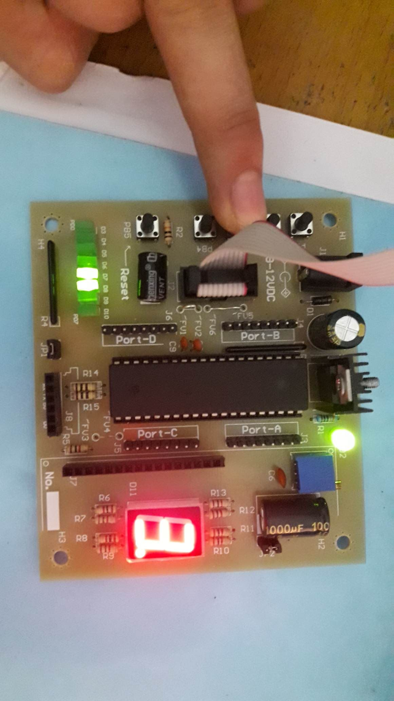
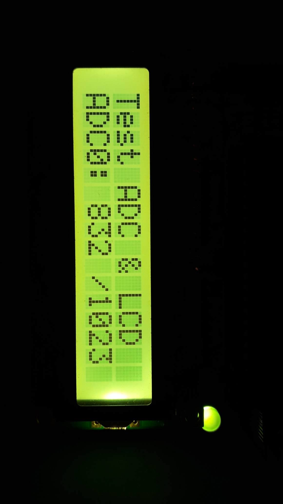
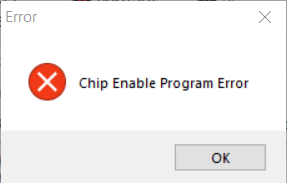
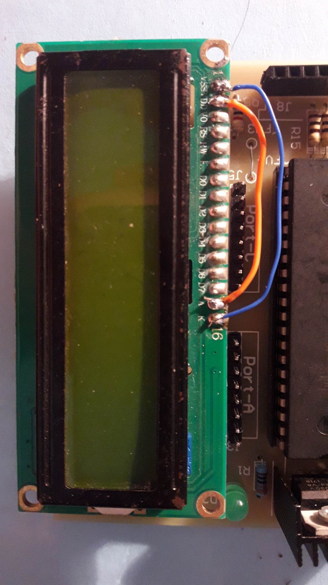

# Project2_DTVT_DHBKHN_2020
 Đây là tài liệu code avr cho đồ án II viện Điên tử Viễn thông thuộc đại học Bach khoa Hà Nội năm 2020.
# Giới thiệu
 13/06/2020  
Đây là git repo chứa dữ liệu đồ án 2 viện Điện tử viễn thông thuộc đại học Bách Khoa Hà Nội. Nôi dung đồ án 2 này mới được áp dụng từ năm 2019. 
 Code được cung cấp từ hướng dẫn và có chỉnh sửa lại một chút do thói quen code của và lỗi mình phát hiện được.
# Chuẩn bị
## Phần cứng 
- AVR development kit 
- SPI usb for AVR
- ATmega16 hoặc ATmega32 hoặc ATmega8  

Kít phát triển được cung cấp bởi phòng thực hành bộ môn. Các bạn hãy hàn và kiểm tra cẩn thận. Nhớ để nhiệt độ mối hàn vừa phải đừng vượt quá 350 độ (do chất lượng PCB không được tốt nên phần via dễ bị bong tróc trong khi hàn). 
 Chip Atmega thì bạn có thể chọn một trong 3 loại trên do chân chúng giống nhau, chỉ khác về dung lượng bộ nhớ flash và RAM. Nêu bạn là sinh viên nghèo và có sẵn một trong 3 con trên thì nên dùng luôn
## AVR studio code 
 Mình sử dụng phiên bản 5.1 do nó miễn phí, có nhiều hỗ trợ trong mô phỏng, edit code mặc dù nó nặng hơn (khoảng 1GB). Các bạn có thể sử dụng phiên bản 4. được thầy cô cung cấp.
 Link tải tại trang chủ:
 https://www.microchip.com/mplab/avr-support/avr-and-sam-downloads-archive

## Progisp
 Phần mềm này được sử dụng để nap file .hex cho chip của AVR
 link tải:
https://drive.google.com/file/d/10oluqVDh33vJdvhIH5wNsJM9OomuUOwH/view?usp=sharing
 
## Sử dụng
1. Clone git từ repo này
2. Mở ứng dụng AVR studio code lên open->'../Do_an_2_DHBKHN_DTVT_K61/Do_an_2_DHBKHN_DTVT_K61.cproj'
3. Ấn build (F7) 
4. Cắm usb và máy tính, kết nối phần header còn lại với kit đông thời mở Progisp lên
5. Cài đặt như hình dưới đây

  
Nhấn Load file, vào thư mục debug của project rồi chọn vào file hex.  

Sau khi set up xong thì ấn nút Auto. Chú ý rằng các bạn chỉ cần set up một lần, mỗi khi build lại code thì file hex sẽ được tự động cập nhật nhé.
Hoặc các bạn có thể tham khảo theo hướng dẫn nạp code tại đây: http://dammedientu.vn/huong-dan-cach-nap-chuong-trinh-cho-atmega8-16-32-voi-mach-nap-usbisp-bid13-html/

# Kết quả
1. LED dẹt và LED 7 thanh

2. Nút nhấn

3. ADC và LCD

# Lỗi thường gặp
## Không nạp được code
Lỗi này thường xảy ra khi các bạn mới nạp code avr lần đầu. Đừng lo lắng quá vì ai cũng gặp lỗi này lần đầu trong đời  
  
Thường là cho nguồn xung do thạch anh cung cấp có vấn đề hoặc là bạn đã set bit puse chưa đúng. Cách khắc phục là hãy kiểm tra lại xem thạch anh đã hàn đúng chưa. Nếu không được nữa thì tham khảo link sau: https://linhkienthaomay.com/huong-dan-DIY/17_H%C6%B0%E1%BB%9Bng-d%E1%BA%ABn-s%C6%B0a-l%E1%BB%97i-khi-set-Fuse-Bit-avr-sai.html

## Nạp code mà mạch không chạy
 Kiểm tra lại các mối hàn, đặc biệt là phần mối hàn ở thạch anh
## LCD không sáng back light
Trên LCD, các bạn hãy hàn mạch chân Anot(A)với nguồn 5V, chân Katot(K) với đất GND. Nên nối luôn trên mạch LCD vì nếu nối trên board sẽ làm giảm tính thẩm mỹ, điều đó làm thầy cô không vui :D 

